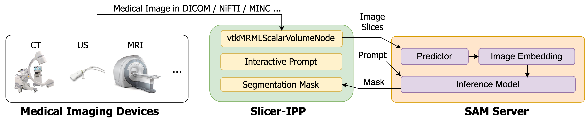
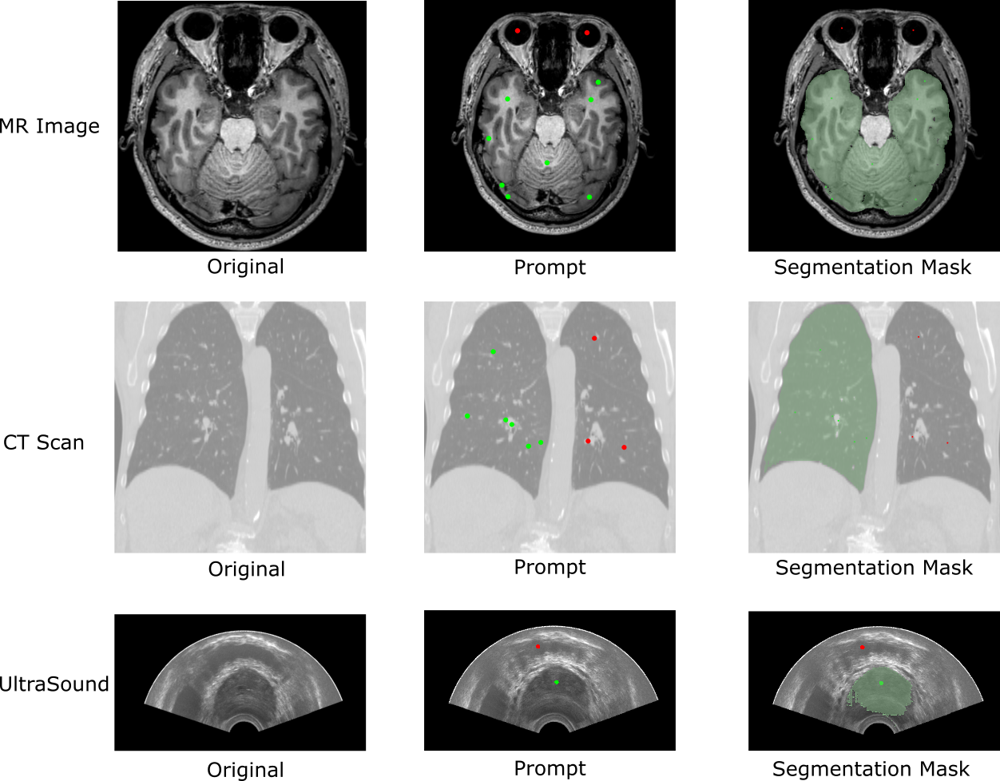

# Summary
The Segment Anything Model (SAM) is a novel image segmentation tool trained with the largest available segmentation dataset. The model has demonstrated that, with efficient prompting, it can create high-quality, generalized masks for image segmentation. However, the performance of the model on medical images requires further validation. To assist with the development, assessment, and application of SAM on medical images, we introduce Segment Any Medical Model (SAMM), an extension of SAM on 3D Slicer - an open-source image processing and visualization software extensively used by the medical imaging community. By combining AI-based medical image models with the 3D Slicer software, SAMM enables users to directly enhance their research and work through the use of AI tools.

# Statement of Need
The advent of large language models (LLM) has led to significant progress in image analysis with potential for future advancements. 
SAM [@kirillov2023segment] is a revolutionary foundation model for image segmentation and has already shown the capability of handling diverse segmentation tasks. 
SAM especially prevails in zero-shot domain generalization cases as compared with existing elaborate, fine-tuned models trained for specific domains. 
An important prospect for the application of SAM would be its adaptation to the complex task of segmenting medical images with significant inter-subject variations and a low signal-to-noise ratio.  

The segmentation task allows separation of different structures in medical images, which are then used to detect the region of interest or reconstruct multi-dimensional anatomical models [@sinha2020multi]. 
The existing AI-based segmentation methods, however, do not fully bridge the domain gap among different imaging modalities, such as computed tomography (CT), magnetic resonance imaging (MRI), or ultrasound (US) [@wang2020deep]. 
In this context, the domain gap refers to the difference in the data format between the source and target domain, which is relevant to the challenge of training AI systems to perform common analysis tasks across different image modalities without the need for a comprehensive dataset.  
Domain gap introduces specific challenges to medical image processing and analysis, as each image modality offers a distinct advantage in visualizing specific anatomical structures and related pathologies (e.g., tumor, bone fracture) among individuals. 
Therefore, a universal tool for medical image segmentation that can handle all modalities as well as anatomical structures would be very valuable.
Conventional machine learning (ML) and deep learning (DL) techniques can potentially achieve this goal with their model trained on large and domain-specialized medical image datasets. 
To achieve this, however, the ML and DL techniques have to overcome a series of critical challenges including (but not limited to) data privacy, ethics, expenses, scalability, data integrity, and validation [@gao2023]. 
In contrast, SAM can perform a new and/or different task at inference time without being trained on the data collected from that task [@kirillov2023segment]. 
This feature makes SAM promising for segmenting multi-modality medical images with less effort. 

Despite the extensive usage of AI-based methodologies in medical image analysis, the use of foundation models within this field remains a largely unexplored area of research. 
However, migrating SAM to the medical image analysis field requires resolving the difference in coordinate systems and image structure between medical images and normal images. 
3D Slicer [@pieper20043d], as an open-source software for medical images, provides routines to read and write various file formats, manipulate 2D and 3D coordinate systems, and present a consistent user interface paradigm and visualization tool. 
Here we provide a unified framework incorporating 3D Slicer and SAM to perform medical image segmentation.

# Architecture and Functionalities

\autoref{fig:samm} presents the overall architecture of SAMM, which consists of a SAM server with a pre-trained model loaded and an interactive prompt plugin for 3D Slicer (Slicer-IPP). Slicer-IPP first handles all the image slices with the built-in interfaces of 3D Slicer. Then, it processes all the images and subsequently maps the embeddings of the images in a binary array format in Random Access Memory (RAM) for efficient storage and retrieval. 

The Slicer-IPP accepts any data formats from different modalities and packs them as binary image files used by SAM. To facilitate communication between 3D Slicer and external tools or services, the platform uses ZeroMQ (ZMQ) [@2013zeromq] messaging library and Numpy [@numpy] memory mapping. ZMQ is a lightweight messaging library that enables high-performance, asynchronous communication between distributed applications. In SAMM, ZMQ and Numpy are employed to transfer images, prompts, and requests between the Slicer-IPP and the SAM Server. The segmentation task is eventually accelerated by applying these two packages. The Slicer-IPP and SAM Server are designed to run five parallel tasks denoted as send inference request (SND_INF), receive inference request (RCV_INF), complete SAM inference (CPL_INF), receive mask transmission (RCV_MSK), and apply mask (APL_MSK). Slicer-IPP hosts SND_INF, RCV_MSK, and CPL_INF, while the server end hosts RCV_MSK and APL_MSK. Each task is an independent loop that is executed synchronously. They run with the effort-first principle, and in the Slicer-IPP, each loop is set to have a 60 ms gap to process other tasks, since 3D Slicer is a single-threaded software. A complete inference cycle starts from SND_INF and ends with APL_MSK. Here we use the term event to represent a  task is executed and completed. 
A complete cycle of the image segmentation consists of five events (see Figure \autoref{fig:sync}), including: (1) sending the inference request (Slicer-IPP); (2) receiving the inference request (SAM Server); (3) completing SAM inference (SAM Server); (4) receiving the mask transmission (Slicer-IPP); and (5) applying the mask (Slicer-IPP). 
For each time instance, the task owner logs the timestamp to a Python data storage object. The log data, generated in chronological order, will be output to a Python pickle file once 1000 segmentation cycles are completed. In Figure \ref{fig:synchronization}, only 60 complete cycles are shown. We evaluate the system performance using the end-to-end latency, defined as the time between a request of inference and application of the inferred mask for the same image slice.

The SAM Server runs in parallel with Slicer-IPP and keeps monitoring the request sent from 3D Slicer. The server end hosts a local SAM, which employs an embedding strategy to incorporate image data fetched from RAM into the model. The image encoder in SAM uses an MAE pre-trained Vision Transformer (ViT) [@dosovitskiy2020image] to downscale the input images and detect (embed) the image features synchronously. The Slicer-IPP provides a prompt (typically, a prompt is a point placed on the image slice) to the end users to add/remove a selected region. The prompt points are transmitted to the prompt encoder of SAM, which subsequently generates a mask using the prompts and pre-loaded image embeddings. The image embedding process is followed by a segmentation inference step based on both the embedding features and user-defined prompts during runtime. Note that the image encoders run once per image, rather than per prompt, which allows the users to segment the same image multiple times with different prompts in real-time. Given that the initialization of image embedding occurs in advance, the subsequent mask generation process can be performed with small latency. 

The Slicer-IPP facilitates the intuitive alignment of diverse coordinates associated with the same target. It can work out with the discrepancies between the RAS (right, anterior, superior) coordinate system, the IJK (slice ID) coordinate system, and the image pixel coordinate system by providing proper conversion functionalities. For instance, at an inference request, Slice-IPP converts the coordinates of RAS to IJK to identify the image ID and then transmits the ID along with the prompts, with its coordinates converted according to the same pattern as how the image are converted, to SAM Server. The mask generated by the inference step, on the other hand, is transformed from the pixel to RAS coordinate system. The examples of SAMM applied on different image modalities are shown in \autoref{fig:diff}.

# Conclusion
In summary, by harmonizing SAM with the open-source 3D Slicer software, we are effectively enhancing the toolkit for managing complex biomedical datasets. This integration enables researchers to take advantage of SAM's cutting-edge segmentation capabilities within the familiar 3D Slicer platform, expanding the range of tasks that can be performed on images using this powerful software tool. The use of ZMQ and Numpy memory mapping also provides the flexibility to customize the communication protocol to fit the user's specific needs, further enhancing the versatility of the 3D Slicer platform. Furthermore, the breadth of our work isn't just limited to the present context. It opens up the potential for further integrating other medical AI models, setting a precedent for ongoing advancements in this field. SAMM fosters a smooth transition between the theoretical advances in AI and their practical application in biomedical imaging and diagnostics. This integration can pave the way for superior segmentation accuracy and promote broader AI adoption in the medical field, thereby shaping the future of biomedical image analysis.

# References
