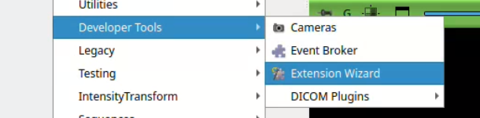
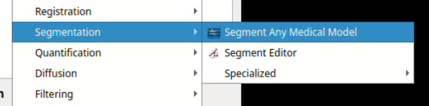
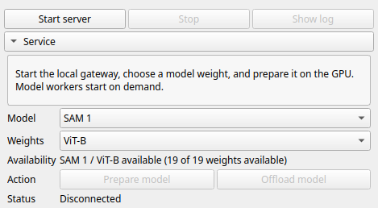
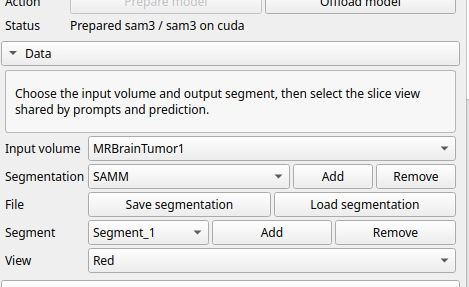
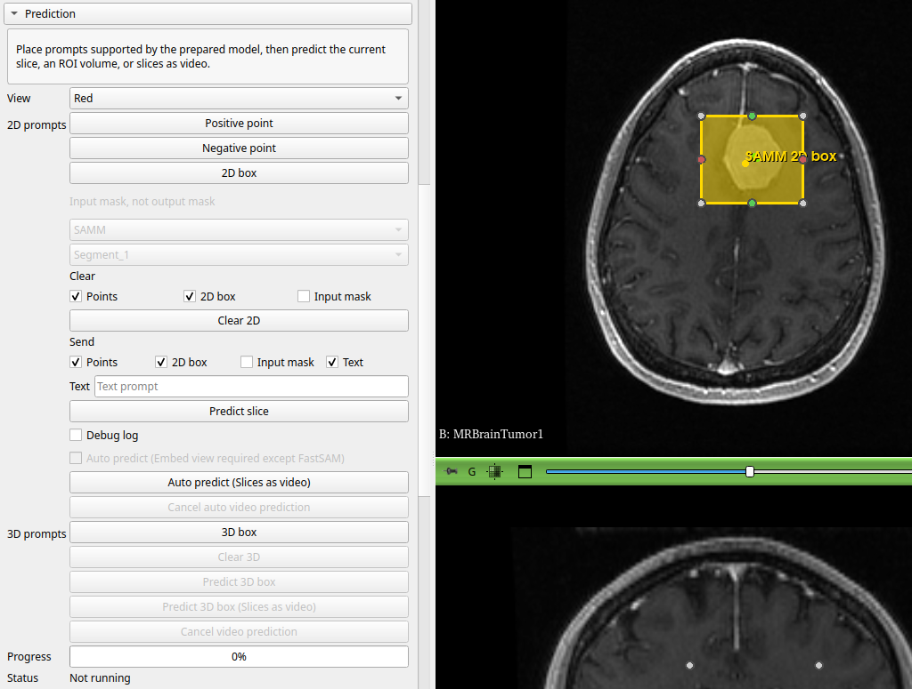
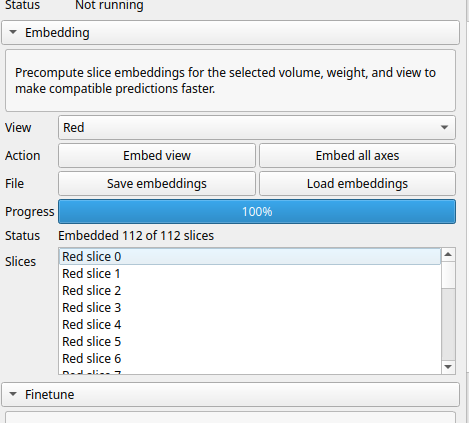
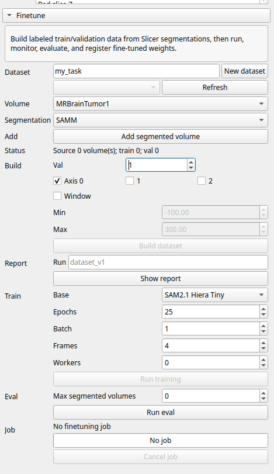
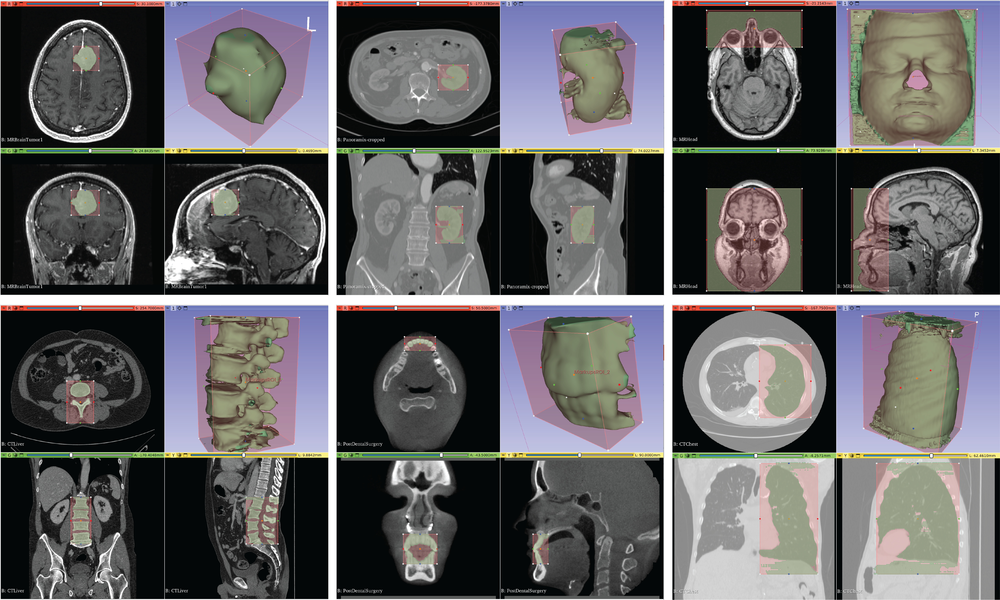

# SAMM

[](https://github.com/bingogome/samm/actions/workflows/ci.yml)
[](https://pixi.sh/)
[](https://download.slicer.org/)
[](https://developer.nvidia.com/cuda-toolkit)

A 3D Slicer extension for interactive medical image segmentation and fine tuning with SAM-family models. Easy server management, all from Slicer GUI.

✨ Check out
[slicer-fast-proto-template](https://github.com/bingogome/slicer-fast-proto-template), the design pattern from SAMM. Use the template as the recommended starting point for a new deep learning model inference or finetuning project.

## 🆕 What's New

- **[2026.07.19] Complete refactor:** SAMM can now set up and manage its inference service entirely from Slicer, with no command-line server launch required. The release supports all available weights and their compatible prompt types across SAM 1, SAM 2.1, MobileSAM, MedSAM, MedSAM Text, MedSAM2, SAM 3, Medical-SAM3, and FastSAM. It also introduces a MedSAM2-style fine-tuning workflow, a streamlined GUI, more robust service management, automated setup, and continuous integration and testing.
- **[2024.01.31] Additional model integrations:** Added MobileSAM and MedSAM with positive and negative point prompts, 2D and 3D boxes, and combined prompting.
- **[2023.05.04] Full IJK-to-RAS direction support:** Fixed segmentation for volumes with custom IJK-to-RAS direction matrices.
- **[2023.04.10] First release:** Introduced interactive medical image segmentation with Meta's Segment Anything Model and real-time inference using cached embeddings.

## ✨ Features

### Model and prompt support

| Model | Points | 2D box | 3D box | Mask | Text | Text + box | Auto predict | Auto predict<br>(slices as video) | 3D box<br>(slices as video) |
| --- | :---: | :---: | :---: | :---: | :---: | :---: | :---: | :---: | :---: |
| SAM 1 | ✓ | ✓ | ✓ | ✓ | — | — | ✓ | — | — |
| SAM 2.1 | ✓ | ✓ | ✓ | ✓ | — | — | ✓ | ✓ | ✓ |
| MobileSAM | ✓ | ✓ | ✓ | ✓ | — | — | ✓ | — | — |
| MedSAM | — | ✓ | ✓ | — | — | — | ✓ | — | — |
| MedSAM Text | — | — | — | — | ✓ | — | ✓ | — | — |
| MedSAM2 | ✓ | ✓ | ✓ | ✓ | — | — | ✓ | ✓ | ✓ |
| SAM 3 | ✓ | ✓ | ✓ | ✓ (2D only) | ✓ | ✓ | ✓ | ✓ | ✓ |
| Medical-SAM3 | — | ✓ | ✓ | — | ✓ | ✓ | ✓ | — | — |
| FastSAM | ✓ | ✓ | ✓ | — | ✓ | — | ✓ | — | — |

`Auto predict` performs independent 2D inference as the user scrolls. The two
slices-as-video modes use temporal propagation and are available
only for SAM 2.1, MedSAM2, and SAM 3. FastSAM performs auto prediction
directly without cached embeddings.

The 3D-box control applies box prompts across the intersecting slices; it does
not imply that every backend has a native 3D prompt encoder. Prompt
combinations and temporal-mode restrictions are detailed under
[Supported Models](#supported-models).

- **Interactive and volume prediction**
  - Predict the current slice, predict a 3D box slice-by-slice, or run automatic prediction while scrolling.
  - Propagate prompted stacks as video with SAM 2.1, MedSAM2, and SAM 3 using auto or 3D-box slices-as-video modes.
  - Stream masks into the selected segment with separate status, progress, cancellation, and partial-result retention.
- **Embeddings and Slicer scene tools**
  - Precompute one view or all three axes, inspect cached slices, and save or load embedding folders.
  - Create, remove, save, and load segmentation nodes and manage their segments without leaving the module.
- **Dataset and finetuning workflow**
  - Export multi-label segmented volumes and build reproducible training and validation datasets.
  - Finetune and evaluate MedSAM2, monitor or cancel jobs, inspect reports, and discover completed checkpoints as new model weights.
- **Operations and diagnostics**
  - Start, reconnect to, stop, and inspect the managed local service from Slicer.
  - Autosave modified segmentations and compatible embedding caches during active sessions.
  - Check service health every three seconds, reconnect when possible, and send session heartbeats so abandoned gateways can shut down safely.
  - Inspect checkpoint availability, model and job status, service logs, and original/overlay prediction artifacts.
  - Log inference input and output for diagnostics.

## Requirements

- Linux x86-64 for the supported Pixi environments and automated setup path.
- [3D Slicer](https://download.slicer.org/); CI and the current compatibility use Slicer 5.12.2.
- [Pixi](https://pixi.sh/) available to the Slicer launcher or installed at `~/.pixi/bin/pixi`.
- Enough VRAM for the chosen checkpoint; large SAM 3 and SAM 1 weights require substantially more memory than MobileSAM or the smallest SAM 2.1 models.

The default Pixi environment contains the lightweight gateway and tests. Each model backend has a separate environment so its CUDA, framework, and upstream-package requirements do not leak into Slicer's Python environment or other variants.

## Project Layout

```text
samm/
  checkpoints/          model weights, created by setup and not committed
  sam_variants/         cloned upstream SAM implementations
  samm/                 3D Slicer extension
  service/              local HTTP gateway and model workers
  finetuning/           MedSAM2 finetuning tools
  tools/                setup, Slicer launcher, and CI helpers
  .github/              GitHub Actions and dependency updates
  pixi.toml             runtime environments and tasks
```

## Setup

### Set up selected variants

From the project root, set up one variant at a time when you only need a subset:

```bash
pixi run setup-sam1
pixi run setup-sam2
pixi run setup-mobile-sam
pixi run setup-medsam
pixi run setup-medsam2
pixi run setup-sam3
pixi run setup-medical-sam3
pixi run setup-fastsam
```

These clone missing variant repositories, install Pixi environments, download public checkpoints, create local checkpoint links, and run import smoke checks.
- For gated models like SAM3, setup asks whether Hugging Face approval is granted, runs `hf auth login`, then downloads the checkpoint.
- Medical-SAM3 setup uses `hf download` to fetch the upstream 2D checkpoint from Hugging Face as `checkpoints/medical_sam3.pt`.
- Checkpoints that are distributed through cloud services like Google Drive are reported when missing.

### Set up every variant

To set up all supported backends:

```bash
pixi run setup-variants
```

### Install 3D Slicer extension

`SD Slicer` &rarr; `Developer Tools` &rarr; `Extension Wizard`.

`Extension Tools` &rarr; `Select Extension` &rarr; import the samm/samm folder.




## Checkpoints

| Variant | Expected checkpoint files |
| --- | --- |
| SAM 1 | `sam_vit_b_01ec64.pth`, `sam_vit_l_0b3195.pth`, `sam_vit_h_4b8939.pth` |
| SAM 2.1 | `sam2.1_hiera_tiny.pt`, `sam2.1_hiera_small.pt`, `sam2.1_hiera_base_plus.pt`, `sam2.1_hiera_large.pt` |
| MobileSAM | `mobile_sam.pt` |
| MedSAM | `medsam_vit_b.pth`, `medsam_text_prompt_flare22.pth` |
| MedSAM2 | `MedSAM2_latest.pt`, `MedSAM2_2411.pt`, `MedSAM2_CTLesion.pt`, `MedSAM2_MRI_LiverLesion.pt`, `MedSAM2_US_Heart.pt` |
| SAM 3 | `sam3.pt` |
| Medical-SAM3 | `medical_sam3.pt` |
| FastSAM | `FastSAM-x.pt`, `FastSAM-s.pt` |

## Supported Models

| Model | Weights | Prompt support |
| --- | --- | --- |
| SAM 1 | ViT-B, ViT-L, ViT-H | Points, 2D box, 3D box, mask input, auto 2D, embeddings |
| SAM 2.1 | Hiera Tiny, Small, Base+, Large | Points, 2D box, 3D box, 3D box and auto slices-as-video, mask input, auto 2D, embeddings |
| MobileSAM | ViT-T | Points, 2D box, 3D box, mask input, auto 2D, embeddings |
| MedSAM | ViT-B | 2D box, 3D box, auto 2D, embeddings |
| MedSAM Text | FLARE22 text | Text, auto 2D, embeddings |
| MedSAM2 | Latest, Nov 2024, CT Lesion, MRI Liver Lesion, US Heart | Points, 2D box, 3D box, 3D box and auto slices-as-video, mask input, auto 2D, embeddings |
| SAM 3 | SAM 3 unified image/video model | Text, text+box, points, 2D box, 3D box, 3D box and auto slices-as-video, mask input for 2D prediction, auto 2D, embeddings |
| Medical-SAM3 | Medical-SAM3 image model | Text, text+box, 2D box, 3D box, auto 2D, embeddings |
| FastSAM | FastSAM-x, FastSAM-s | Text, points, 2D box, 3D box, auto 2D without embeddings |

SAMM protocol 1.2 includes temporal propagation for SAM 2.1, MedSAM2, and SAM 3. The
Slicer `Predict 3D box (Slices as video)` control sends the ROI-intersecting
slice range as an ordered frame stack, prompts its middle frame with the box,
and propagates masks in both directions. `Auto predict (Slices as video)` uses
the current slice's enabled prompt and propagates through the full selected
view. SAM 2.1 and MedSAM2 accept point, box, or mask seeds. SAM 3 accepts text,
box, text+box, points, or points refined from a box; its public video API does
not expose mask seeding. The existing `Predict 3D box` and scrolling
`Auto predict` controls keep their independent 2D behavior.

Model-specific behavior:

- MedSAM base is box-only.
- MedSAM Text uses the FLARE22 CLIP text prompt checkpoint and is text-only.
- For 2D SAM 3 prediction, text is supported alone or with a box. Text mixed with points or mask input is intentionally not exposed.
- SAM 3 slices-as-video uses the upstream unified detector/tracker from the same loaded checkpoint. Multiple SAM 3 video objects are unioned into SAMM's single output segment.
- Medical-SAM3's upstream 2D inference documents separate box and text prompts. SAMM also exposes the processor-supported text+box combination, but the checkpoint does not contain SAM3's separate point/mask interactive-head weights.
- Medical-SAM3 3D-box prediction is SAMM's per-slice 2D-box workflow; it does not use the upstream 3D checkpoint.
- FastSAM accepts exactly one prompt mode per prediction: text, points, or box. It does not support mask input or cached embeddings in SAMM.

## Run In Slicer

1. Open **Developer Tools → Extension Wizard** in Slicer.

   

2. Select this repository's `samm/` extension folder. Alternatively, add that folder under **Edit → Application Settings → Modules → Additional module paths**.
3. Open **Segmentation → Segment Any Medical Model**.

   

4. Click `Start server`.

   

5. Select a model family and weight.
6. Click `Prepare model`.
7. Select an input volume, segmentation, and output segment.

   

8. Place prompts and click `Predict slice`.

   

9. Enable scrolling `Auto predict`, run `Auto predict (Slices as video)`, or run one of the 3D-box modes. Some features require caching embeddings first.

   

The Slicer module starts a localhost gateway and launches the selected model worker only when needed. It reconnects to an already running gateway when possible. `Stop` disconnects Slicer and terminates the managed process. `Show log` displays the log path and recent output. If Slicer quits while the managed server is running, SAMM shows a six-second countdown that closes it by default and also provides a `Leave running` option.

Server logs are written under `logs/`. While the module is active, Slicer checks
the service every three seconds, reconnects when possible, and sends a session
heartbeat containing the latest autosave paths. The gateway stops itself after
10 minutes without a heartbeat unless a finetuning job is queued or running.

## Embedding controls

- `Embed view` precomputes every slice in the selected view; `Embed all axes` processes Red, Green, and Yellow.
- The embedding panel lists cached slices and reports submitted, completed, and total counts.
- `Save embeddings` writes the current cache to an embedding folder; `Load embeddings` restores a compatible folder for the prepared weight.
- Embedding-capable models require a complete selected view for scrolling auto prediction. FastSAM predicts directly and deliberately disables cached embeddings.

## Finetuning controls

- Create or select named datasets and see source, training, and validation volume counts.
- Export all non-empty segments from a Slicer volume as one multi-label source NPZ; overlapping segments are rejected.
- Choose validation count, slice axes, and optional intensity window before building the MedSAM2 dataset.
- Configure the base checkpoint, run name, epochs, batch size, sampled frames, dataloader workers, and evaluation limit.
- Run, monitor, or cancel server-side training and evaluation jobs. The UI shows progress, log path, latest log line, errors, and text reports.
- Completed runs with a valid `samm_model.json` and checkpoint appear automatically as additional MedSAM2 weights.

   

## Prompt Workflows

Use the view selectors to choose `Red`, `Green`, or `Yellow`. Data, prediction, and embedding views stay synchronized.

For 2D prediction:

1. Place positive or negative points, a 2D box, choose an input mask, or enter text depending on the selected model.
2. Use the `Send` toggles to choose which prompt types are included.
3. Click `Predict slice`.
4. SAMM writes the returned mask into the selected output segment.

For 3D box prediction, click `3D box` and place and resize the ROI. `Predict 3D box`
streams each intersecting slice as an independent 2D box job. With SAM 2.1,
MedSAM2, or SAM 3, `Predict 3D box (Slices as video)` instead seeds the middle ROI slice,
propagates in both directions, clips every returned mask to the original ROI,
and writes results as they arrive. The video job can be cancelled without
removing masks already written to the output segment.

   

For scrolling auto prediction, embedding-capable models require the selected
view to be embedded first. FastSAM runs scrolling auto prediction directly and
does not require `Embed view`.

With SAM 2.1, MedSAM2, or SAM 3, `Auto predict (Slices as video)` does not require
cached embeddings. Place or enable a supported prompt on the current slice,
then click the button. SAMM uploads the full selected view, uses the current
slice as the seed, and propagates in both directions. SAM 2.1 and MedSAM2 accept
points, a 2D box, or an input mask; input masks must be used alone. SAM 3 accepts
text, a 2D box, text+box, points, or points+box, but not an input-mask seed.
Results are written as they arrive, and cancellation keeps masks already
written.

The enabled `Send` options determine which supported prompts reach the backend. Model-specific restrictions still apply. For example, MedSAM base requires a box; MedSAM Text is text-only; FastSAM accepts one prompt mode; SAM 3 and Medical-SAM3 have the combinations described in the model table above.

When `Debug log` is enabled, each 2D prediction writes the unannotated uint8 RGB image sent to the model, an input-prompt overlay, an output overlay, and JSON metadata under `logs/predictions/`. 


## Finetuning

In Slicer:

1. Open the `Finetune` panel.
2. Type a dataset name and click `New dataset`, or select an existing dataset and use `Refresh` after external changes.
3. Select the same volume and segmentation used in the Data panel.
4. Click `Add segmented volume`.
5. Choose validation count, axes, and an optional intensity window, then click `Build dataset`.
6. Choose a base model.
7. Configure the run and training settings, then run training, evaluation, and report actions from the panel.

Training and eval run on the SAMM server. The job area shows status, log path, latest log line, and training progress by epoch.

See [finetuning/README.md](finetuning/README.md) for dataset format, CLI commands, eval, and reports.

## More Documentation

- [slicer-fast-proto-template](https://github.com/bingogome/slicer-fast-proto-template): recommended starting point for a new SAMM-style Slicer project.
- [sam_variants/README.md](sam_variants/README.md): setup details and prompt support by variant.
- [service/README.md](service/README.md): gateway API and worker behavior.
- [finetuning/README.md](finetuning/README.md): finetuning workflow.

## Citation 
If you use SAMM in your research, please consider use the following BibTeX entry.

```bibtex
@article{liu2024segment,
  title={Segment Any Medical Model Extended},
  author={Liu, Yihao and Zhang, Jiaming and Diaz-Pinto, Andres and Li, Haowei and Martin-Gomez, Alejandro and Kheradmand, Amir and Armand, Mehran},
  journal={arXiv preprint arXiv:2403.18114},
  year={2024}
}
@article{liu2023samm,
  title={SAMM (Segment Any Medical Model): A 3D Slicer Integration to SAM},
  author={Liu, Yihao and Zhang, Jiaming and She, Zhangcong and Kheradmand, Amir and Armand, Mehran},
  journal={arXiv preprint arXiv:2304.05622},
  year={2023}
}
```
